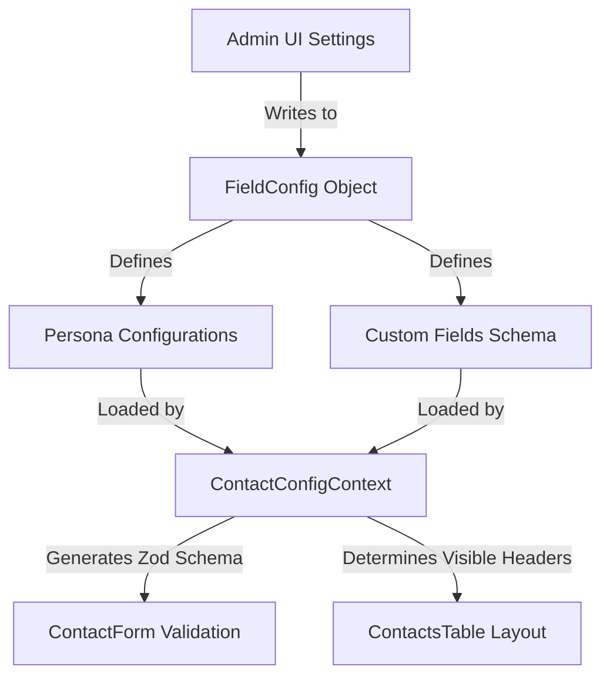

# Contact Module Blueprint

The **Contact Module** serves as the central directory and CRM (Customer Relationship Management) system for Darul Quran. It manages students, guardians, staff, donors, and volunteers dynamically, utilizing a highly customizable metadata-driven architecture.

---

## 1. Directory Structure & Key Files

The Contact Module spans the following files in the project workspace:

### Frontend State & Utilities (`frontend/src/lib/`)
* **[contactFields.ts](file:///Users/syedaalin/Downloads/darul-quran/frontend/src/lib/contactFields.ts)**: Declares all TypeScript interfaces (`Contact`, `PhoneNumber`, etc.), core fields, static metadata (genders, country codes, lifecycle stages), and legacy compat structures.
* **[ContactConfigContext.tsx](file:///Users/syedaalin/Downloads/darul-quran/frontend/src/lib/ContactConfigContext.tsx)**: Global React context facilitating dynamic validation (via Zod), active columns representation, and profile completeness algorithms.
* **[contactFieldsStore.ts](file:///Users/syedaalin/Downloads/darul-quran/frontend/src/lib/contactFieldsStore.ts)**: Handles synchronization of fields metadata with the local storage database.
* **[contactConstants.ts](file:///Users/syedaalin/Downloads/darul-quran/frontend/src/lib/contactConstants.ts)**: Exposes formatting and parsing tools for telephone numbers.

### Frontend Components (`frontend/src/components/contacts/`)
* **[ContactsTable.tsx](file:///Users/syedaalin/Downloads/darul-quran/frontend/src/components/contacts/ContactsTable.tsx)**: Tabular layout supporting dynamic visible columns, quick search, rating edits, and direct row selection.
* **[ContactKanban.tsx](file:///Users/syedaalin/Downloads/darul-quran/frontend/src/components/contacts/ContactKanban.tsx)**: Drag-and-drop board organized by **Lifecycle Stage** (Lead, Active Student, Alumnus, Staff, Donor, Volunteer, Parent).
* **[ContactDetailDrawer.tsx](file:///Users/syedaalin/Downloads/darul-quran/frontend/src/components/contacts/ContactDetailDrawer.tsx)**: Rich slide-out panel containing complete tabs, activity feeds (calls, notes, WhatsApp logs), document attachments, and relationships.
* **[ContactForm.tsx](file:///Users/syedaalin/Downloads/darul-quran/frontend/src/components/contacts/ContactForm.tsx)**: Adaptive form that renders fields based on selected Persona and active configurations.
* **[DuplicateDetection.tsx](file:///Users/syedaalin/Downloads/darul-quran/frontend/src/components/contacts/DuplicateDetection.tsx)**: Runs deduplication heuristics comparing phones, emails, and names.
* **[WhatsAppPanel.tsx](file:///Users/syedaalin/Downloads/darul-quran/frontend/src/components/contacts/WhatsAppPanel.tsx)**: Contextual panel containing messaging templates for parent updates and alerts.
* **[ContactSyncPanel.tsx](file:///Users/syedaalin/Downloads/darul-quran/frontend/src/components/contacts/ContactSyncPanel.tsx)**: Bridges browser clients with local devices (CSV and VCF import/export).
* **[ContactsSettingsPanel.tsx](file:///Users/syedaalin/Downloads/darul-quran/frontend/src/components/contacts/ContactsSettingsPanel.tsx)**: Dashboard configuration allowing administrators to toggle tabs, configure fields required status, and register new custom attributes.

---

## 2. Data Model

The data model for contacts is designed to handle rich hierarchical structures (like multiple phone numbers, addresses, and relations) and arbitrary key-value pairs representing runtime custom fields.

### TypeScript Specifications

```typescript
export interface PhoneNumber {
  label: string;
  number: string;
  whatsapp?: boolean;
  countryCode?: string;
}

export interface EmailAddress {
  label: string;
  address: string;
}

export interface Address {
  line1?: string;
  city?: string;
  state?: string;
  country?: string;
  label?: string;
}

export interface SocialLink {
  platform: string;
  url: string;
}

export interface EmergencyContact {
  name?: string;
  relationship?: string;
  phone?: string;
  contactId?: string | number; // Links to another Contact record
}

export interface ContactRelationship {
  contactId: string | number;   // Links to another Contact record
  type: string;                 // e.g. "Father", "Spouse", "Guardian"
}

export interface ContactActivity {
  id: string;
  type: "note" | "stage_change" | "whatsapp" | "email" | "system" | "task" | "call";
  content: string;
  date: string;
  by?: string;
  metadata?: Record<string, unknown>;
}

export interface ContactAttachment {
  id: string;
  name: string;
  type: string;
  size: number;
  url: string;
  date: string;
}

export interface Contact {
  id: string | number;
  personaId?: string;           // Links to a PersonaConfig (e.g., "student")
  name: string;                 // Composite full name
  firstName: string;
  lastName?: string;
  gender?: string;
  dob?: string;
  isSyed?: boolean;
  avatar?: string | null;
  createdAt?: string;
  updatedAt?: string;
  phones?: PhoneNumber[];
  emails?: EmailAddress[];
  addresses?: Address[];
  socials?: SocialLink[];
  emergencyContacts?: EmergencyContact[];
  notes?: string;
  occupation?: string;
  communicationPref?: string;
  lifecycleStage?: string;      // "Lead" | "Active Student" | "Alumnus" | "Staff" | "Donor" etc.
  rating?: number;              // 1 to 5 stars
  relationships?: ContactRelationship[];
  activities?: ContactActivity[];
  attachments?: ContactAttachment[];
  profileHealth?: number;       // Computed score (0 to 100)
  aiSummary?: string;           // LLM-generated summary
  [key: string]: unknown;       // Supports custom schema fields (e.g. "custom_donor_level")
}
```

---

## 3. Metadata Engine & Customization

The system shifts control of the UI schema layout from code to a configurable database representation.



### Persona Gating
Each contact belongs to a **Persona** (such as Student, Donor, or Staff). The `PersonaConfig` determines:
* Which tabs (Phone numbers, Social links, Emergency contacts) are visible.
* Which fields within those tabs are active or required.
* Which custom attributes apply.

### Custom Fields Schema
Administrators can register new custom fields dynamically with variables like:
* **Type**: `text` | `textarea` | `number` | `date` | `url` | `email` | `select` | `multiselect` | `tags` | `boolean`.
* **Constraints**: Required, Unique, character limits (Min/Max length), and numeric limits.

---

## 4. Key Capabilities & System Logic

### A. Profile Health Computation
To ensure data quality, the context computes a completeness percentage based on the presence of key fields. The total score accumulates up to a maximum of 100:

| Field | Weight | Description |
| :--- | :--- | :--- |
| **First Name / Full Name** | 15% | Basic identification |
| **Last Name** | 5% | Surname presence |
| **Gender** | 5% | Demographic detail |
| **Date of Birth** | 5% | Age-group segmentation |
| **Avatar Image** | 10% | Visual profile completeness |
| **Phone Number(s)** | 10% | Valid communication channel |
| **Email Address(es)** | 10% | Formal communication channel |
| **Address** | 5% | Geographical details |
| **Lifecycle Stage** | 5% | CRM pipeline classification (non-Lead) |
| **Social Links** | 5% | Digital presence |
| **Relationships** | 10% | CRM network links |
| **Star Rating** | 5% | Priority status |
| **Notes** | 5% | Miscellaneous documentation |
| **Attachments** | 5% | Supplementary documents |

### B. Normalization & Hydration
To prevent data duplication and inconsistencies, linked modules (like the **Student Module**) reference contacts via `contactId`.
* **Hydration**: When retrieving list arrays, the system injects contact details (name, phone, email, gender, dob) dynamically from the matching contact record.
* **Normalization**: Before saving records, redundant details from the student object are stripped away to keep the database normalized.

### C. Duplicate Detection
The duplicate detection engine evaluates contacts to identify potential matches using:
1. **Direct Matches**: Checks for identical email addresses or normalized phone numbers.
2. **Fuzzy Matches**: Uses basic Jaro-Winkler or Levenshtein distance metrics on names to suggest merging options when spellings are slightly different.

### D. Communication Integrations
* **WhatsApp Panel**: Direct API endpoints let teachers and administrators construct messages with placeholder variables (e.g. `{{name}}`, `{{class}}`) and launch them in the browser via WhatsApp Web protocols.
* **Synchronization Manager**: Supports formatting standard VCARD format payloads (.vcf) and CSV templates, allowing contacts to be moved to and from smart devices seamlessly.
