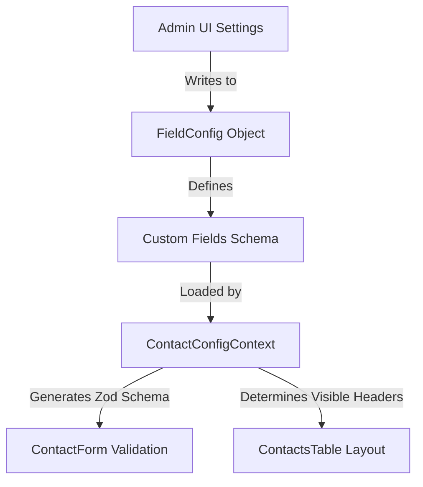

# Contact Module Blueprint

The **Contact Module** serves as the central directory and CRM (Customer Relationship Management) system for MMS. It manages students, guardians, staff, donors, and volunteers dynamically, utilizing a highly customizable metadata-driven architecture.

---

## 1. Directory Structure & Key Files

The Contact Module spans the following files in the project workspace:

### Page Entry Point (`apps/frontend/src/pages/`)
* **[Contacts.tsx](file:///Users/syedaalin/Downloads/MMS 2/apps/frontend/src/pages/Contacts.tsx)**: Main page wrapper that orchestrates tab routes: **Operations** (switching between List and Kanban views), **Analytics** (rendering live KPI summaries and reports), and **Configuration** (rendering field registries, preferences, and device synchronizers). Handles global triggers for deduplication, bulk actions, and modals. `ContactConfigProvider` mounts once in `App.tsx` — not on this page.

### Shared Types (`packages/shared/src/`)
* **[contactTypes.ts](file:///Users/syedaalin/Downloads/MMS 2/packages/shared/src/contactTypes.ts)**: Canonical TypeScript types (`Contact`, `PhoneNumber`, `Address`, `FieldDefinition`, `FieldConfig`, `TAB_REGISTRY`, etc.) and field/tab registries consumed by frontend and backend.
* **[utils.ts](file:///Users/syedaalin/Downloads/MMS 2/packages/shared/src/utils.ts)**: Shared utilities — `parsePhoneNumber`, `formatDate`, `getInitials`, `getAvatarColor`, `toTitleCase`, `optimizeImage`.

### Frontend State & Utilities (`apps/frontend/src/lib/`)
* **[contactFields.ts](file:///Users/syedaalin/Downloads/MMS 2/apps/frontend/src/lib/contactFields.ts)**: Re-exports from `@mms/shared` plus frontend-specific field helpers.
* **[ContactConfigContext.tsx](file:///Users/syedaalin/Downloads/MMS 2/apps/frontend/src/lib/ContactConfigContext.tsx)**: Global React context facilitating real-time field configuration changes, dynamic validation (via Zod), dynamic active columns representation, and profile completeness algorithms.
* **[contactFieldsStore.ts](file:///Users/syedaalin/Downloads/MMS 2/apps/frontend/src/lib/contactFieldsStore.ts)**: Handles synchronization of field configuration metadata with the local storage database.
* **[contactsData.ts](file:///Users/syedaalin/Downloads/MMS 2/apps/frontend/src/lib/contactsData.ts)**: Declares initial mock contact datasets and seed helper configurations.

### Frontend Components (`apps/frontend/src/components/contacts/`)
* **[ContactsTable.tsx](file:///Users/syedaalin/Downloads/MMS 2/apps/frontend/src/components/contacts/ContactsTable.tsx)**: Tabular layout supporting dynamic visible columns, quick search, rating edits, and direct row selection.
* **[ContactKanban.tsx](file:///Users/syedaalin/Downloads/MMS 2/apps/frontend/src/components/contacts/ContactKanban.tsx)**: Drag-and-drop board organized by **Lifecycle Stage** (Lead, Active Student, Alumnus, Staff, Donor, Volunteer, Parent).
* **[ContactDetailDrawer.tsx](file:///Users/syedaalin/Downloads/MMS 2/apps/frontend/src/components/contacts/ContactDetailDrawer.tsx)**: Rich slide-out panel containing complete tabs, activity feeds (calls, notes, WhatsApp logs), document attachments, and relationships.
* **[ContactForm.tsx](file:///Users/syedaalin/Downloads/MMS 2/apps/frontend/src/components/contacts/ContactForm.tsx)**: Adaptive modal form that handles layout structure and tab navigation (Identity, Phones, Emails, Addresses, Socials, Emergency, Relationships).
* **[DuplicateDetection.tsx](file:///Users/syedaalin/Downloads/MMS 2/apps/frontend/src/components/contacts/DuplicateDetection.tsx)**: Runs deduplication heuristics comparing phones, emails, and names.
* **[WhatsAppPanel.tsx](file:///Users/syedaalin/Downloads/MMS 2/apps/frontend/src/components/contacts/WhatsAppPanel.tsx)**: Contextual panel containing messaging templates for parent updates and alerts.
* **[ContactSyncPanel.tsx](file:///Users/syedaalin/Downloads/MMS 2/apps/frontend/src/components/contacts/ContactSyncPanel.tsx)**: Bridges browser clients with local devices (CSV and VCF import/export).
* **[ContactsSettingsPanel.tsx](file:///Users/syedaalin/Downloads/MMS 2/apps/frontend/src/components/contacts/ContactsSettingsPanel.tsx)**: Dashboard configuration allowing administrators to toggle tabs, configure fields required status, and register new custom attributes.
* **[AvatarCropper.tsx](file:///Users/syedaalin/Downloads/MMS 2/apps/frontend/src/components/contacts/AvatarCropper.tsx)**: Circular modal crop UI offering zoom, rotation, and drag translation on a canvas to format profile pictures.
* **[ColumnCustomizer.tsx](file:///Users/syedaalin/Downloads/MMS 2/apps/frontend/src/components/contacts/ColumnCustomizer.tsx)**: Drag-and-drop column picker popover enabling visible column toggles and layout ordering.
* **[ContactStatsBar.tsx](file:///Users/syedaalin/Downloads/MMS 2/apps/frontend/src/components/contacts/ContactStatsBar.tsx)**: Displays metrics counts (Total, Active, Verified phones) and database profile health breakdowns (Complete, Partial, Stale).
* **[ContactsToolbar.tsx](file:///Users/syedaalin/Downloads/MMS 2/apps/frontend/src/components/contacts/ContactsToolbar.tsx)**: Toolbar container for text search, sorting selectors, dynamic filters, and column customization triggers.

### Form Subcomponents (`apps/frontend/src/components/contacts/form/`)
* **[FormPrimitives.tsx](file:///Users/syedaalin/Downloads/MMS 2/apps/frontend/src/components/contacts/form/FormPrimitives.tsx)**: Shared styles, labels, warning banners, and registry-driven field renderers (`RegistryField`, `EditableSelect`, file/location/AI inputs) — replaces the deleted `DynamicField.tsx` and `TabCustomFields.tsx`.
* **[BasicTab.tsx](file:///Users/syedaalin/Downloads/MMS 2/apps/frontend/src/components/contacts/form/BasicTab.tsx)**: Form inputs for identity attributes, DOB, gender, and avatar triggers.
* **[PhoneTab.tsx](file:///Users/syedaalin/Downloads/MMS 2/apps/frontend/src/components/contacts/form/PhoneTab.tsx)**: Form inputs for phone numbers, WhatsApp status toggles, and country dial code selectors.
* **[EmailTab.tsx](file:///Users/syedaalin/Downloads/MMS 2/apps/frontend/src/components/contacts/form/EmailTab.tsx)**: Form inputs for email addresses and custom label assignments.
* **[AddressTab.tsx](file:///Users/syedaalin/Downloads/MMS 2/apps/frontend/src/components/contacts/form/AddressTab.tsx)**: Form inputs for locations (Street, City, State, Country).
* **[SocialTab.tsx](file:///Users/syedaalin/Downloads/MMS 2/apps/frontend/src/components/contacts/form/SocialTab.tsx)**: Form inputs for social media profile names and platform categories.
* **[EmergencyTab.tsx](file:///Users/syedaalin/Downloads/MMS 2/apps/frontend/src/components/contacts/form/EmergencyTab.tsx)**: Form inputs for emergency contacts, utilizing a contact picker to link records.
* **[RelationshipsTab.tsx](file:///Users/syedaalin/Downloads/MMS 2/apps/frontend/src/components/contacts/form/RelationshipsTab.tsx)**: Form inputs to define family or CRM links between contacts.

### Shared UI (`apps/frontend/src/components/ui/`)
* **[ContactDraggableFieldList.tsx](file:///Users/syedaalin/Downloads/MMS 2/apps/frontend/src/components/ui/ContactDraggableFieldList.tsx)**: Contact-specific drag-and-drop field list (`@hello-pangea/dnd`) for reordering built-in or custom fields and toggling enabled/required/unique constraints. Canonical replacement for the deleted `contacts/settings/DraggableFieldList.tsx`.
* **[DraggableFieldList.tsx](file:///Users/syedaalin/Downloads/MMS 2/apps/frontend/src/components/ui/DraggableFieldList.tsx)**: Generic field list used by other modules (students, finance, etc.).

---

## 2. Data Model

The data model for contacts is designed to handle rich hierarchical structures (like multiple phone numbers, addresses, and relations) and arbitrary key-value pairs representing runtime custom fields.

### TypeScript Specifications

Types live in `@mms/shared` (`packages/shared/src/contactTypes.ts`). Summary:

```typescript
export interface PhoneNumber {
  label: string;
  number: string;
  whatsapp?: boolean;
  countryCode?: string;
}

export interface EmailAddress {
  label: string;
  address: string;
}

export interface Address {
  line1?: string;
  city?: string;
  state?: string;
  country?: string;
  label?: string;
}

export interface SocialLink {
  platform: string;
  url: string;
}

export interface EmergencyContact {
  name?: string;
  relationship?: string;
  phone?: string;
  contactId?: string | number; // Links to another Contact record
}

export interface ContactRelationship {
  contactId: string | number;   // Links to another Contact record
  type: string;                 // e.g. "Father", "Spouse", "Guardian"
}

export interface ContactActivity {
  id: string;
  type: "note" | "stage_change" | "whatsapp" | "email" | "system" | "task" | "call";
  content: string;
  date: string;
  by?: string;
  metadata?: Record<string, unknown>;
}

export interface ContactAttachment {
  id: string;
  name: string;
  type: string;
  size: number;
  url: string;
  date: string;
}

export interface Contact {
  id: string | number;
  name: string;                 // Composite full name
  firstName: string;
  lastName?: string;
  gender?: string;
  dob?: string;
  isSyed?: boolean;
  avatar?: string | null;
  createdAt?: string;
  updatedAt?: string;
  phones?: PhoneNumber[];
  emails?: EmailAddress[];
  addresses?: Address[];
  socials?: SocialLink[];
  emergencyContacts?: EmergencyContact[];
  notes?: string;
  occupation?: string;
  communicationPref?: string;
  lifecycleStage?: string;      // "Lead" | "Active Student" | "Alumnus" | "Staff" | "Donor" etc.
  rating?: number;              // 1 to 5 stars
  relationships?: ContactRelationship[];
  activities?: ContactActivity[];
  attachments?: ContactAttachment[];
  profileHealth?: number;       // Computed score (0 to 100)
  aiSummary?: string;           // LLM-generated summary
  [key: string]: unknown;       // Supports custom schema fields (e.g. "custom_donor_level")
}
```

---

## 3. Metadata Engine & Customization

The system shifts control of the UI schema layout from code to a configurable database representation.



### Custom Fields Schema
Administrators can register new custom fields dynamically with variables like:
* **Type**: `text` | `textarea` | `number` | `date` | `url` | `email` | `select` | `multiselect` | `tags` | `boolean` | `file` | `location` | `ai_summary`.
* **Constraints**: Required, Unique, character limits (Min/Max length), and numeric limits.

### Form Rendering & Validation Pipeline
1. **Context Broadcasting**: `ContactForm` reads current configurations via the `useContactConfig` hook to decide which tabs are displayed, which fields are required, and what custom properties must render.
2. **Schema Compiling**: The context generates a dynamic Zod validator using `buildDynamicContactSchema`. If a field is optional, empty input strings are preprocessed into `undefined` to prevent validation triggers.
3. **Error Routing**: When validation fails, `formatZodIssues` translates raw Zod errors into human-readable strings (e.g., mapping array index errors to `Phone #1: number cannot be empty.`) and directs the user to the correct form tab.

### Draggable Reordering Engine
Administrators can reorder fields within any tab.
1. The **Settings Panel** renders lists in `ContactDraggableFieldList` (`components/ui/`) using `@hello-pangea/dnd`.
2. Drag events modify the `order` array inside `tabFieldConfig`.
3. The custom order is stored, prompting `ContactForm` to render inputs in that layout and `ContactConfigContext` to order table columns identically.

---

## 4. Key Capabilities & System Logic

### A. Profile Health Computation
To ensure data quality, the context computes a completeness percentage based on the presence of key fields. The total score accumulates up to a maximum of 100:

| Field | Weight | Description |
| :--- | :--- | :--- |
| **First Name / Full Name** | 15% | Basic identification |
| **Last Name** | 5% | Surname presence |
| **Gender** | 5% | Demographic detail |
| **Date of Birth** | 5% | Age-group segmentation |
| **Avatar Image** | 10% | Visual profile completeness |
| **Phone Number(s)** | 10% | Valid communication channel |
| **Email Address(es)** | 10% | Formal communication channel |
| **Address** | 5% | Geographical details |
| **Lifecycle Stage** | 5% | CRM pipeline classification (non-Lead) |
| **Social Links** | 5% | Digital presence |
| **Relationships** | 10% | CRM network links |
| **Star Rating** | 5% | Priority status |
| **Notes** | 5% | Miscellaneous documentation |
| **Attachments** | 5% | Supplementary documents |

### B. Circular Avatar Cropper Canvas Pipeline
The `AvatarCropper` provides a precision circular modal crop UI using HTML5 Canvas:
1. **Interactive Transforms**: Enables translation offsets, rotational increments of 90 degrees, and decimal-based scaling.
2. **Clipping & Masking**: Clips the active image to a centered circle while drawing a dim overlay outside the border.
3. **WebP Compression**: Exports the cropped selection onto a secondary output canvas, translating details to a square `webp` data URL at `0.78` quality to optimize storage limits.

### C. Dynamic Column Builder
Table headers automatically adapt to configuration state changes:
1. Column configurations are parsed in `availableColumns` under `ContactConfigContext`.
2. Checks ensure only enabled fields/tabs are built.
3. Custom fields are appended to the columns list.
4. Users check, uncheck, or drag columns inside `ColumnCustomizer` to update `visibleColumns` dynamically.

### D. Normalization & Hydration
To prevent data duplication and inconsistencies, linked modules (like the **Student Module**) reference contacts via `contactId`.
* **Hydration**: When retrieving list arrays, the system injects contact details (name, phone, email, gender, dob) dynamically from the matching contact record.
* **Normalization**: Before saving records, redundant details from the student object are stripped away to keep the database normalized.

### E. Duplicate Detection
The duplicate detection engine evaluates contacts to identify potential matches using:
1. **Direct Matches**: Checks for identical email addresses or normalized phone numbers.
2. **Fuzzy Matches**: Uses basic Jaro-Winkler or Levenshtein distance metrics on names to suggest merging options when spellings are slightly different.

### F. Communication Integrations
* **WhatsApp Panel**: Direct API endpoints let teachers and administrators construct messages with placeholder variables (e.g. `{{name}}`, `{{class}}`) and launch them in the browser via WhatsApp Web protocols.
* **Synchronization Manager**: Supports formatting standard VCARD format payloads (.vcf) and CSV templates, allowing contacts to be moved to and from smart devices seamlessly.
